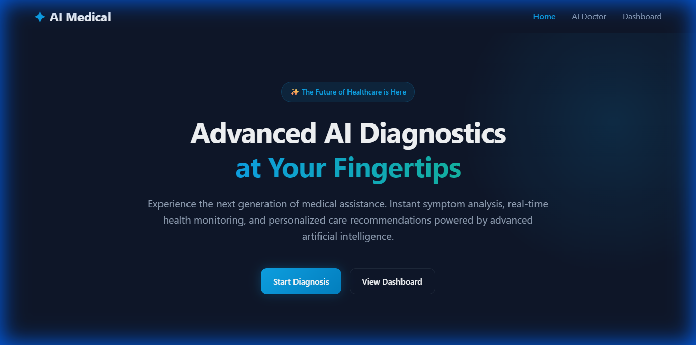
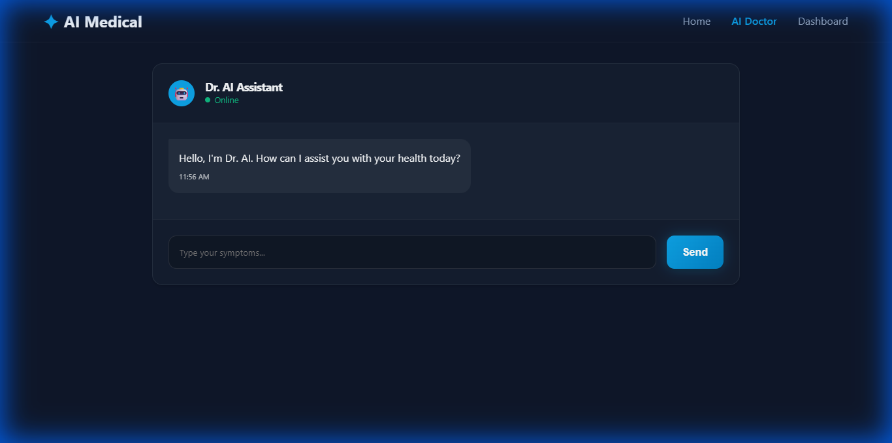
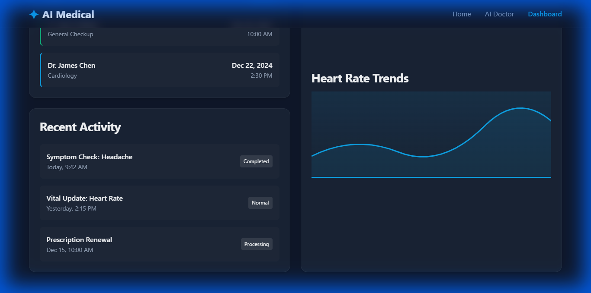

# ✦ AI Medical

**The Future of Healthcare, Today.**

A collaborative and premium "Simulated AI Doctor" application built with React, Vite, and Vanilla CSS. Access advanced diagnostics (simulated) and manage your health from a beautiful, futuristic dashboard.

[](https://vercel.com/new/clone?repository-url=https%3A%2F%2Fgithub.com%2Fyounglord3302%2Fai-doctor)
[](https://ai-doctor-gold.vercel.app/)

**🔗 Live Demo:** [https://ai-doctor-gold.vercel.app/](https://ai-doctor-gold.vercel.app/)

---

## ✨ Features

- **🤖 AI Doctor Chat**: Interact with a simulated AI for instant symptom checking.
- **📊 Patient Dashboard**: View health stats, heart rate trends, and activity history.
- **📅 Appointment Management**: Track upcoming and past medical appointments.
- **🎨 Premium Design**: Glassmorphism, smooth animations, and a modern dark mode aesthetic.
- **⚡ Fast Performance**: Built on Vite for lightning-fast reloading and building.

## 📸 Screenshots

### Landing Page



### AI Doctor Chat



### Patient Dashboard



## 🛠️ Tech Stack

- **Frontend**: React, TypeScript, Vite
- **Styling**: Vanilla CSS (Variables, Flexbox/Grid, Animations)
- **Routing**: React Router DOM v6
- **Deployment**: Vercel

## 🚀 Getting Started

1. **Clone the repository**:

    ```bash
    git clone https://github.com/younglord3302/ai-doctor.git
    cd ai-doctor
    ```

2. **Install dependencies**:

    ```bash
    npm install
    ```

3. **Run the development server**:

    ```bash
    npm run dev
    ```

## 📄 License

This project is open source and available under the [MIT License](LICENSE).
